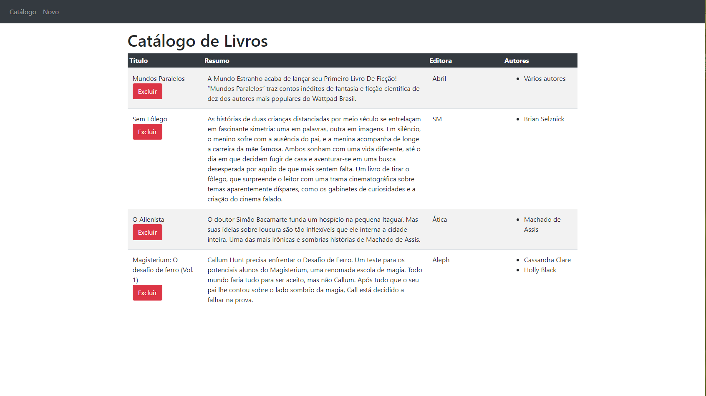
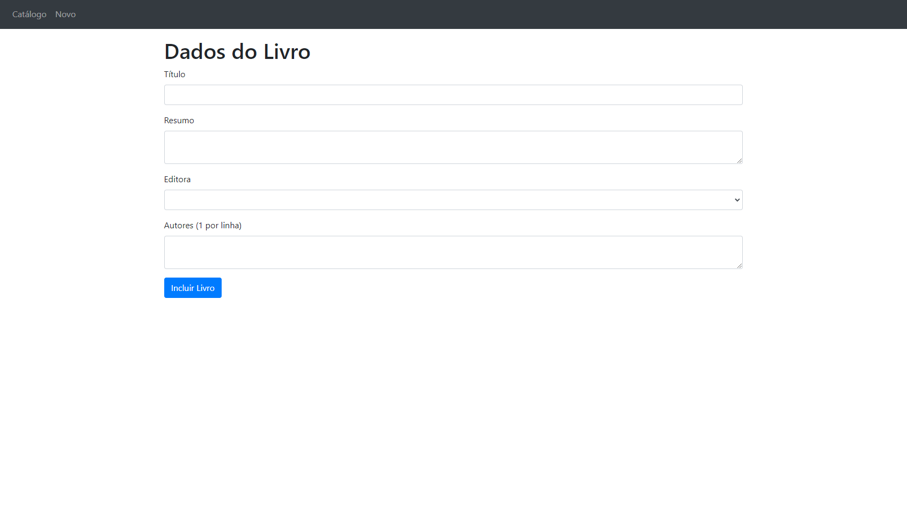
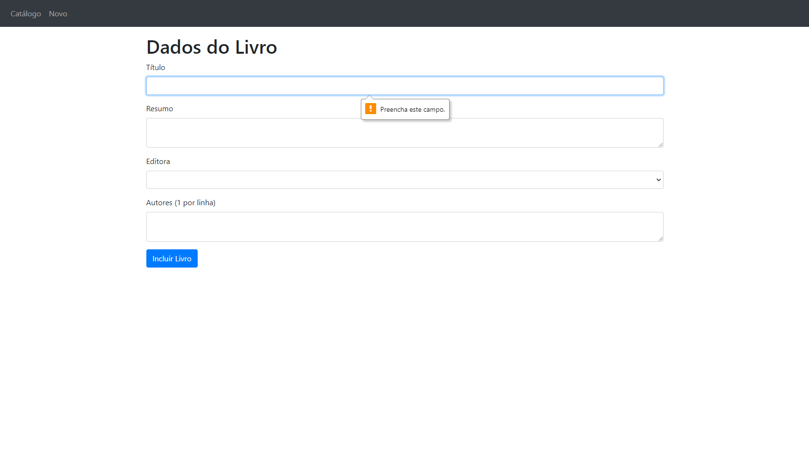

# 

# RPG0012 - Vamos colocar o framework para acessar um banco!

---

Missão prática | Nível 5 | Mundo 2 do Curso Desenvolvimento Full-Stack da Universidade Estácio.

---

## 📋 Projeto

Integração do Back-end (servidor), com o Front-end utilizando `3 frameworks Javascript` diferentes, para criação e consumo de dados do banco de dados local MongoDB, uma `Missão Prática` do curso de `Desenvolvimento Full-Stack` da `Universidade Estacio de Sá`.

---

## 📝 Descrição

Para facilitar a implementação deste projeto precisamos:

- Criar um objetivo especifico.
- Materiais necessários para a prática.
- Metodologia de Desenvolvimento da Prática.

---

## 💼 Objetivo

Criar um servidor baseado em Express e Mongoose, com acesso ao banco de dados MongoDB, além de utilizar diversar tecnologias Front-end, assim me tornando capacitado a lidar com plataformas de desenvolvimento variadas, e satisfazer às necessidades de um mercado cada vez mais heterogêneo, abaixo algumas descrições gerais:

1. Utilizar o banco de dados `MongoDB` para a criação de repositório `NoSQL`.
2. Implementar servidor baseado em `Express` e `Mongoose`.
3. Implementar biblioteca cliente de acesso em `JavaScript`.
4. Utilizar front-ends baseados em `ReactJs`,`NextJs` e `Angular`.

---

## 🛠 Materiais_necessários

Materiais necessários para a prática:

1. Computador com acesso à internet;
2. Editor de código Visual Studio Code;
3. Banco de dados MongoDB e ferramenta Compass.
4. Ambiente de desenvolvimento NodeJS.
5. Navegador de internet instalado no computador.

---

## 🔎 Imagens

Página Inicial | Catálogo

Pagina Cadastro

Verficação de Formulários

---

## 👩‍💻 Autor

Este repositório foi desenvolvido por
|Autor|
|----------------|
| Lucas Alves Vieira da Silva |
